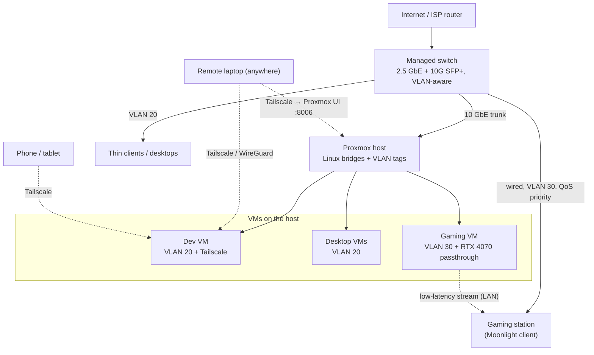

# Home Thin-Client + Central VM Server — Research & Recommendations

> Orchestrated multi-team research. Prices captured **July 2026**. Hardware
> prices are Memory Express (CAD, incl. taxes extra). Azure prices are
> pay-as-you-go **Windows** monthly (730 hrs) in USD unless noted.
> All figures are estimates for planning, not quotes.

---

## 0. The vision (restated)

- **Thin clients** in every room (cheap, low-power, near-silent).
- **One big server in the basement** holding all the CPU / GPU / RAM.
- **Per-person VMs** spun up on demand, resized as needs change.
- **One gaming VM** with a real GPU and minimum latency (candidate:
  Steam Remote Play / Moonlight over LAN).
- Buy hardware through **Memory Express**.
- Compare **build vs. Azure vs. other clouds**.

---

## 1. Team 1 — Networking & Remote Desktop Architects

### 1.1 How the setup actually works

```
                 ┌─────────────────────────────────────────┐
                 │        BASEMENT SERVER (hypervisor)       │
                 │  Proxmox VE / Windows Server + Hyper-V     │
                 │                                           │
                 │  ┌──────┐ ┌──────┐ ┌──────┐ ┌──────────┐ │
                 │  │VM: Dad│ │VM:Mom│ │VM:Kid│ │GAMING VM │ │
                 │  │ 4 vCPU│ │4 vCPU│ │2 vCPU│ │8 vCPU +  │ │
                 │  │ 8 GB  │ │ 8 GB │ │ 4 GB │ │ GPU pass │ │
                 │  └──────┘ └──────┘ └──────┘ └────┬─────┘ │
                 └──────────────────────────────────┼───────┘
                        │ 2.5/10 GbE wired backbone  │
        ┌───────────────┼──────────────┬────────────┴─────────┐
   ┌────┴───┐      ┌────┴───┐     ┌────┴────┐          ┌──────┴─────┐
   │Thin PC │      │Thin PC │     │Thin PC  │          │Gaming thin │
   │Office  │      │Bedroom │     │Kitchen  │          │TV/Console  │
   │(RDP)   │      │(RDP)   │     │(RDP)    │          │(Moonlight) │
   └────────┘      └────────┘     └─────────┘          └────────────┘
```

**Two distinct traffic classes** — this is the single most important design insight:

| Class | Users | Protocol | Latency need | GPU need |
|---|---|---|---|---|
| **Productivity / desktop** | Parents, kids, browsing, office, homework | RDP, Parsec, Apache Guacamole | Tolerant (30–80 ms fine) | None or shared/virtual GPU |
| **Gaming** | 1 gaming VM | **Moonlight/Sunshine** or **Steam Remote Play** or **Parsec** | Very strict (<16 ms glass-to-glass) | Dedicated GPU via **passthrough** |

### 1.2 The hypervisor choice

- **Proxmox VE (free, Debian/KVM)** — best for mixed Linux/Windows VMs,
  mature **PCIe/GPU passthrough (VFIO)**, snapshots, live resize of vCPU/RAM.
  Recommended base.
- **Windows Server + Hyper-V** — friendlier if the household is all-Windows;
  supports **GPU Partitioning (GPU-P)** to share one GPU across VMs, and
  **DDA** (Discrete Device Assignment) for full passthrough. Licensing cost.
- **Unraid / TrueNAS Scale** — nice if you also want NAS + Docker in one box.

### 1.3 The gaming VM — the hard part

This is where 80% of the pain lives. Key facts:

1. **GPU passthrough is required** for real gaming performance. The GPU is
   bound to *one* VM at a time via VFIO/DDA. You cannot casually "share" a
   single gaming GPU across two simultaneous gamers without either:
   - **vGPU / MIG / GPU-P** (partitioning) — supported on NVIDIA RTX
     workstation/datacenter cards and via Hyper-V GPU-P on consumer cards
     (unofficial, fiddly), or AMD MxGPU. Consumer GeForce cards historically
     block official vGPU (though NVIDIA relaxed vGPU on some RTX cards in
     2024+ — verify per driver).
   - **Two physical GPUs** if two people must game at once.
2. **Latency budget** for a great experience (≈ imperceptible):
   - Encode + network + decode should stay **under ~16 ms** for 60 fps.
   - On a **wired LAN** with Sunshine/Moonlight (NVENC/AV1) you can hit
     **~4–10 ms** added latency at 1080p/1440p60. This is genuinely couch-viable.
   - **Steam Remote Play** works but Moonlight/Sunshine is usually lower
     latency and more configurable. **Parsec** is the other strong option
     (excellent quality, easy, host-app model).
3. **Wired beats Wi-Fi, always** for the gaming stream. If you must use
   Wi-Fi, use **Wi-Fi 6/6E on 5/6 GHz, AP in the same room, QoS**, and expect
   occasional frame drops. For the gaming station, **run Ethernet**.
4. **USB/controller passthrough & audio** need attention — Moonlight/Parsec
   handle controllers well; low-latency audio sync is a common gotcha.
5. **The GPU still needs a display target** — use a **virtual display / HDMI
   dummy plug** so the passthrough GPU renders at the resolution you stream.

### 1.4 Biggest hurdles & pain points (ranked)

1. **GPU passthrough setup** — IOMMU groups, VFIO binding, NVIDIA "Code 43"
   (mitigated on modern drivers), vBIOS quirks. Budget a weekend.
2. **Concurrent GPU users** — one consumer GPU = one gamer at a time.
   Multi-gamer households need multiple GPUs or vGPU-capable cards.
3. **Networking backbone** — 1 GbE is *fine* for a couple of streams;
   go **2.5 GbE (cheap now) or 10 GbE** if several 4K streams + file traffic
   coexist. Managed switch + VLANs + QoS to protect the gaming stream.
4. **Single point of failure** — if the basement box dies, the *whole house*
   loses its computers. Plan for a **UPS**, backups, and ideally spare parts.
5. **Power & heat & noise** — a loaded server pulls 400–800 W under gaming
   load. Basement placement helps noise; watch summer heat and electricity cost.
6. **Windows licensing** — one Windows license *per VM* (or Windows Server +
   VDA/RDS CALs). Linux VMs sidestep this.
7. **Peripheral fidelity** — webcams, Bluetooth, high-refresh mice,
   multi-monitor, and DRM'd streaming apps (Netflix in a VM) can misbehave.
8. **Thin client capability** — the "gaming" thin client must decode
   H.265/AV1 at your target res/fps. A $120 mini PC or an NVIDIA Shield /
   Steam Link / decent Android TV box can do this; a Raspberry Pi 5 handles
   1080p60 Moonlight well.

### 1.5 Recommended thin-client options

| Device | ~CAD | Good for |
|---|---|---|
| Raspberry Pi 5 (8 GB) + case | ~$140 | 1080p60 Moonlight, RDP desktops |
| Beelink / Mini PC (N100) | ~$220 | 1080p–4K decode, full Windows/Linux thin client |
| Used Dell/HP thin client (Wyse) | ~$80–150 | RDP productivity seats |
| NVIDIA Shield TV / Steam Link | ~$70–260 | Living-room Moonlight/Steam gaming |

> **Match the codec:** to benefit from the RTX 4070's hardware **AV1** encoding,
> the *client* must **decode AV1** (Pi 5, N100, recent phones/TVs do; older
> Shields/laptops may only do H.265 — still fine, just less efficient).

---

## 2. Team 2 — Memory Express Hardware Pricing (live)

> Pulled from memoryexpress.com. Processor category was rate-limited (HTTP 403)
> during scraping; CPU prices below are current market estimates and should be
> re-verified in-cart. GPU and RAM prices are live captures.

### 2.1 Live GPU prices (relevant SKUs)

| GPU | VRAM | ~CAD | Note |
|---|---|---|---|
| RTX PRO 6000 Blackwell **Server Edition 96 GB** | 96 GB | **$18,799.99** | The "do vGPU + everything" card; special order |
| Asus ROG Strix RTX 5070 Ti | 16 GB | $1,599.99 | Strong 1440p/4K gaming passthrough |
| Asus PRIME RTX 5070 Ti | 16 GB | $1,229.99 | Best value 5070 Ti |
| Sapphire/Asus RX 9070 XT | 16 GB | $999.99 (sale) | Great price/perf; AMD (MxGPU history) |
| Asus PRIME RTX 5060 Ti | 16 GB | $829.99 | Budget gaming VM |
| ASRock Arc B580 | 12 GB | $409.99 | Cheap secondary/encoder GPU |

### 2.2 Live RAM prices (DDR5)

| Kit | ~CAD |
|---|---|
| 32 GB (2×16) DDR5-6000 CL30 | ~$670–740 |
| 64 GB (2×32) DDR5-6000 CL30 (Kingston FURY) | **$1,384.99** |
| 96 GB (2×48) DDR5 high-end | ~$1,285 |
| Note | ECC/RDIMM for EPYC/Threadripper is priced separately & higher |

### 2.3 CPU / platform (market estimates — verify in cart)

| Part | ~CAD | Cores | Fit |
|---|---|---|---|
| Ryzen 9 7950X / 9950X | ~$650–900 | 16 | Great value host for 3–5 light VMs + 1 gamer |
| Threadripper 7960X + TRX50 board | ~$2,000 + $900 | 24 | Many PCIe lanes → multiple GPUs / passthrough headroom |
| EPYC (used/entry) + board | ~$1,500–3,000 | 16–48 | Max RAM channels/ECC, true server reliability |
| High-airflow case + 850–1000 W PSU + cooling | ~$700 | — | — |
| 2× NVMe 2 TB (VM store) | ~$400 | — | — |
| 2.5/10 GbE managed switch + cabling | ~$300–600 | — | — |

### 2.4 Representative build totals (one-time, hardware only)

| Tier | Description | ~CAD (one-time) |
|---|---|---|
| **Starter** | Ryzen 9950X, 128 GB DDR5, 1× RX 9070 XT (gaming passthrough), 4 TB NVMe, 2.5 GbE, 4 thin clients | **~$6,000–7,500** |
| **Family** | Threadripper 7960X, 256 GB ECC, 1× RTX 5070 Ti (gaming) + 1× B580 (encode/2nd desktop GPU), 8 TB NVMe, 10 GbE, UPS, 5 thin clients | **~$9,500–12,500** |
| **Prosumer / multi-gamer** | EPYC/Threadripper, 256–512 GB ECC, RTX PRO 6000 96 GB (real vGPU for several VMs) **or** 2–3 gaming GPUs, 10 GbE, redundant PSU/UPS | **~$22,000–35,000+** |

> **Reality check:** the "share one powerful GPU across everyone" dream is only
> *clean* with a vGPU-capable pro card (RTX PRO 6000 = ~$18.8k alone). For a
> normal family, **1 gaming GPU + software-rendered/virtual GPUs for desktops**
> is dramatically cheaper and covers 95% of real usage.

---

## 3. Team 3 — Azure Comparison (live pay-as-you-go, Windows)

The Azure-equivalent of "spin up a GPU VM per person" uses the **NV-series**
(graphics/VDI) sizes. Live monthly prices (730 hrs, Windows PAYG):

### 3.1 GPU VMs (graphics / gaming-ish)

| Azure size | GPU | vCPU / RAM | PAYG $/mo | 1-yr reserved $/mo |
|---|---|---|---|---|
| NV6ads A10 v5 | 1/6 A10 | 6 / 55 GB | $331 | $276 |
| NV18ads A10 v5 | 1/2 A10 | 18 / 220 GB | $1,168 | $972 |
| **NV36ads A10 v5** | **1× A10 (24 GB)** | 36 / 440 GB | **$2,336** | $1,944 |
| NV4ads V710 v5 | 1/6 V710 | 4 / 16 GB | $243 | $199 |
| **NV24ads V710 v5** | **1× V710 (24 GB)** | 24 / 128 GB | **$1,460** | $1,197 |
| NC24ads A100 v4 | 1× A100 80 GB | 24 / 220 GB | $2,681 | $2,232 |

### 3.2 CPU-only VMs (the "desktop" seats)

| Azure size | vCPU / RAM | PAYG $/mo | Spot $/mo |
|---|---|---|---|
| D4s v5 | 4 / 16 GB | $140 | ~$30 |
| D8s v5 | 8 / 32 GB | $280 | ~$59 |
| B4ls v2 (burstable) | 4 / 8 GB | $107 | ~$48 |

### 3.3 Modeled household on Azure (1 gamer + 3 desktops, always-on)

| Item | Size | $/mo (PAYG) |
|---|---|---|
| Gaming VM | NV36ads A10 v5 | $2,336 |
| 3× desktop VMs | 3× D4s v5 | $420 |
| Storage/egress/IP (est.) | — | ~$150 |
| **Total (PAYG)** | | **≈ $2,900 / mo (~$34,800 / yr USD)** |
| Total (1-yr reserved + spot desktops) | | ≈ $2,050 / mo |

> **Verdict:** For **always-on** household use, Azure is **the wrong tool** —
> a **single year** of the always-on gaming VM alone (~$28k USD) exceeds the
> entire **Family-tier home build**. Azure only wins if usage is **bursty**
> (a few hours/week) where you can **deallocate** VMs and pay per-hour, or if
> you refuse to own/maintain hardware. Cloud GPU VMs are also **not tuned for
> low-latency gaming** (they're VDI/AI parts) and add internet-path latency.

---

## 4. Team 4 — Alternative Cloud Platforms (live)

### 4.1 Raw GPU rental — Vast.ai (marketplace, per-second billing)

| GPU | ~$/hr (median) | If used ~100 hr/mo |
|---|---|---|
| RTX 4090 (24 GB) | ~$0.35–0.39 | ~$39/mo |
| RTX 5090 (32 GB) | ~$0.42–0.48 | ~$48/mo |
| RTX 6000 Ada (48 GB) | ~$0.60 | ~$60/mo |
| A100 80 GB | ~$0.53–0.73 | — |

Cheapest raw horsepower by far, but: marketplace reliability varies,
data-center latency (not LAN), and you're renting other people's machines —
great for **compute/AI bursts**, poor for a **24/7 household desktop fabric**.

### 4.2 Turnkey cloud PCs / gaming

| Service | Model | Notes |
|---|---|---|
| **Shadow PC** | Full RTX Windows cloud PC, **flat monthly subscription** (~$30–45 CAD/mo range, promos to −20%) | Closest "a whole PC per person" cloud product; install anything; good for **1 user per subscription**. No household VDI fabric, but simple. |
| **Parsec** | **Remote-desktop software** (not compute) | This is a **tool for your own LAN setup** — peer-to-peer, 4K/60, 4:4:4, very low latency. Free tier for personal; Teams/Warp paid. **Use this on the home build.** |
| **Paperspace (now DigitalOcean)** | Gradient plans $8–$39/mo + hourly GPU compute | Dev/ML-oriented; hourly GPU desktops; not gaming-optimized. |
| **NVIDIA GeForce NOW** | Subscription cloud *gaming* (catalog-limited) | Cheapest path if the only goal is **playing games** — no VM ownership, no install-anything. |
| **AWS** | G4dn/G5/G6 GPU EC2 + **Amazon DCV** streaming | e.g. g4dn.xlarge (T4) ~$0.526/hr on-demand; g5.xlarge (A10G) ~$1.006/hr. Similar economics to Azure — **bursty only**. |
| **Google Cloud** | G2 (L4) / N1+T4 + Chrome Remote Desktop | Comparable; bursty only. |

### 4.3 What the market says

- **For always-on, whole-house VDI + gaming:** self-hosted wins on cost by a
  wide margin once utilization is high. Break-even vs. Azure is typically
  **6–12 months**.
- **For "I just want to game sometimes":** **GeForce NOW** or **Shadow** beat
  both building and Azure on hassle and upfront cost.
- **For AI/compute bursts:** **Vast.ai / Paperspace / AWS spot** are unbeatable
  per-hour — pair them *with* the home build (offload heavy training to cloud).

---

## 5. Orchestrator's synthesis & recommendation

### 5.1 The core trade-off

| Approach | Upfront | Ongoing | Latency | Best when |
|---|---|---|---|---|
| **Home build (recommended)** | $6–12k CAD | Power (~$30–70/mo) + maintenance | **Best (LAN)** | Always-on, multiple daily users |
| **Azure / AWS GPU VMs** | ~$0 | **$2,000–2,900/mo** always-on | Internet path | Bursty, no hardware ownership |
| **Shadow PC (per user)** | ~$0 | ~$35/mo × users | Internet path | 1–2 gamers, zero admin |
| **Vast.ai / Paperspace** | ~$0 | ~$0.35–0.7/hr | Data-center | AI/compute bursts only |
| **GeForce NOW** | ~$0 | ~$10–22/mo | Internet path | Gaming-only, catalog games |

### 5.2 Recommended plan (hybrid)

1. **Build the basement server** (Family tier ~$9.5–12.5k) with **Proxmox VE**.
2. **Gaming:** 1× **RTX 5070 Ti** passed through to a Windows gaming VM,
   streamed over **wired LAN** with **Sunshine + Moonlight** (fallback: Steam
   Remote Play / Parsec). Run Ethernet to the gaming station.
3. **Desktops:** thin Linux/Windows VMs (2–4 vCPU, 8 GB) over **RDP or Parsec**;
   resize vCPU/RAM live as people's needs grow.
4. **Networking:** 2.5 GbE minimum (10 GbE for the server uplink), managed
   switch with **QoS/VLAN** to protect the gaming stream, plus a **UPS**.
5. **Resilience:** nightly VM snapshots/backups to a NAS or second disk; keep a
   spare boot SSD. The whole house depends on this box.
6. **Cloud as a spillover, not a foundation:** keep a **Vast.ai / Paperspace**
   account for occasional heavy GPU/AI jobs, and consider **GeForce NOW /
   Shadow** as a cheap backup if a second person wants to game simultaneously
   before you invest in a second GPU.

### 5.3 The one big caveat to decide early

**How many people need to game (GPU-accelerated) at the same time?**
- **One at a time →** single gaming GPU, cheapest, clean. ✅ Recommended start.
- **Two+ at once →** either buy a second gaming GPU (~+$1–1.6k each) or invest
  in a **vGPU-capable pro card** (RTX PRO 6000 96 GB ≈ $18.8k) — a big jump.

---

## 6. Suggested follow-up teams (round 2)

1. **Power & TCO team** — model 3-year total cost (electricity at your local
   rate, hardware depreciation, Windows licensing) vs. Shadow/Azure.
2. **vGPU feasibility team** — test whether your chosen consumer GPU + current
   NVIDIA/AMD drivers allow multi-VM GPU sharing (GPU-P / vGPU / MxGPU) so two
   people can game on one card.
3. **Bill-of-materials team** — turn the Family-tier build into an exact
   Memory Express cart with in-stock SKUs and a wiring/rack diagram.
4. **Networking QoS team** — concrete switch/AP model picks, VLAN plan, and
   Sunshine/Moonlight tuning profiles per room.
5. **Migration/standards-refresh team** — re-price the build every 12–18 months
   and define an upgrade cadence (GPU swaps, RAM adds) so the server stays current.

---

## 7. Scale-out plan — start with one node, grow into a redundant cluster

**Goal:** buy a **Starter node now**, but make choices that let you *add* nodes
later for (a) more concurrent PCs/gamers and (b) **redundancy so one server
dying doesn't take the house down**. This is the single best long-term
architecture and it costs almost nothing extra up front — you just avoid
dead-end decisions.

### 7.1 The key idea: a Proxmox *cluster*, added one node at a time

Proxmox VE clusters natively. You run each server as a "node," and the cluster
gives you: one management UI for all nodes, **live migration** of VMs between
nodes, **replicated storage**, and **High Availability (HA)** — if a node dies,
its VMs **auto-restart on a surviving node**.

```
 PHASE 1 (now)            PHASE 2 (add a node)          PHASE 3 (true HA)
 ┌──────────┐             ┌──────────┐ ┌──────────┐      ┌────┐ ┌────┐ ┌────┐
 │ Node A   │             │ Node A   │ │ Node B   │      │ A  │ │ B  │ │ C  │
 │ everyone │   ─────►    │ gamers + │ │ desktops │ ──►  │ +GPU│ │+GPU│ │ n/a│
 │ one box  │             │ 1 GPU    │ │ + backup │      └──┬─┘ └─┬──┘ └─┬──┘
 └──────────┘             └────┬─────┘ └────┬─────┘         └──Ceph shared──┘
                               └─ ZFS repl ─┘              3-node auto-failover
                               + Pi QDevice (quorum)
```

### 7.2 Quorum: why 2 nodes needs a tie-breaker

A cluster must have a **majority (quorum)** to make decisions safely. With an
**even** number of nodes a tie can freeze the cluster. Fixes:

- **2 nodes + a QDevice** — run a tiny vote-only helper on a **Raspberry Pi**
  (~$120) or any always-on small box. Cheap, effective. ✅ recommended for Phase 2.
- **3 nodes** — natural majority, no helper needed. ✅ the target for Phase 3.

### 7.3 Storage: how the redundancy actually works

| Option | Nodes | What it gives | Network need | Cost |
|---|---|---|---|---|
| **ZFS + replication** | 2 | VMs copied to the other node every 1–15 min; on failure you restart from the last copy (lose seconds–minutes of state) | 2.5 GbE ok | cheapest |
| **Ceph** (shared) | 3+ | Truly shared, self-healing storage; **live migration + instant HA failover**, no data loss | **10 GbE mandatory, dedicated NIC** | more disks/RAM |

Start with **ZFS replication** (Phase 2), graduate to **Ceph** at 3 nodes
(Phase 3) if you want seamless failover. **Ceph caveat (per infra review):** its
replication/rebalance traffic **saturates a 1–2.5 GbE link during a node failure**
and causes cluster-wide VM disk stalls (guest I/O-wait, stutter, even kernel
panics) — so Ceph needs **10 GbE on a physically separate interface** from
client/RDP/Moonlight traffic. Below 3 nodes or without 10 GbE, stay on ZFS
replication.

### 7.4 The GPU / gaming caveat (important)

- A VM using **GPU passthrough cannot *live*-migrate** — the GPU is bolted to
  one node. **HA can still restart** that gaming VM on another node, **but only
  if that node also has a compatible GPU.**
- So for **gaming redundancy** (or two people gaming at once), put a GPU in
  **at least two nodes**. Desktop/productivity VMs (no passthrough) migrate and
  fail over freely.
- Practical rule: **desktops get HA "for free"; each gamer needs a physical GPU
  somewhere in the cluster.**

### 7.5 What to buy *now* so you never hit a dead end

Choose the Starter node, but lock in these "future-proofing" decisions:

1. **Networking:** buy a switch with **a few 10 GbE / SFP+ ports** (e.g. a
   2.5 GbE switch with 2× SFP+ uplinks). Add a **10 GbE NIC** to the server now
   or leave a PCIe slot free. A dedicated **cluster/replication link** (second
   NIC or VLAN) keeps storage sync off the gaming path.
2. **Motherboard:** pick one with **≥2 PCIe slots with usable lanes** (so you
   can add a second GPU or NIC) and **4 RAM slots** (start at 2, add later).
3. **PSU & case:** size for growth — **850–1000 W** and airflow for a 2nd GPU.
4. **Storage:** NVMe boot + separate **VM data pool on ZFS** from day one (this
   is what replicates later). Leave bays/M.2 slots free.
5. **Standardize on Proxmox VE** now, even as a single node — a lone node
   becomes "node A" of a cluster later with no rebuild.
6. **UPS** — non-negotiable once the house depends on the box.

### 7.6 Phased roadmap & cost

| Phase | What you add | Gives you | Approx. added CAD |
|---|---|---|---|
| **1 — Starter node (now)** | Ryzen 9950X (has iGPU), 128 GB DDR5, **reuse existing RTX 4070 12 GB** for the gaming VM, 4 TB NVMe (ZFS), 2.5 GbE + SFP+ switch, UPS, 3–4 thin clients, Proxmox | Whole household today; 1 gamer; cluster-ready foundation | **~$5,000–6,000** (GPU reused) |

> **Reusing your RTX 4070 (12 GB):** ideal Phase-1 move. It's a great
> single-gamer passthrough card (1080p/1440p high, some 4K) and its **Ada
> Lovelace NVENC encodes AV1 in hardware** — excellent for low-latency
> Sunshine/Moonlight streaming. Requirements: (1) pick a CPU **with an iGPU**
> (e.g. Ryzen 9950X) so the **host uses the iGPU** and the 4070 is dedicated to
> the gaming VM; (2) a board with **IOMMU** enabled and a full x16 slot;
> (3) ~200 W of PSU headroom + the 8-pin/12VHPWR cable. Note: moving the 4070
> out of your current desktop turns **that desktop into another thin client** —
> which fits the whole plan. Consumer GeForce passthrough works fine on Proxmox
> (the old "Code 43" block is a non-issue on modern drivers). Saves ~$1,000.
| **2 — Second node + quorum** | Node B (can be lighter/cheaper, or a 2nd gaming node with its own GPU) + **Pi QDevice** + ZFS replication + 10 GbE link | Failover (restart on Node B), more capacity, backup box; optional 2nd simultaneous gamer | **+$2,500–5,000** |
| **3 — Third node + Ceph** | Node C, move to **Ceph** shared storage, enable full **HA** | **Automatic, near-zero-downtime failover**; scale to more concurrent VMs/gamers | **+$3,000–6,000** |

> **Net:** the Starter node is essentially the same money as the standalone
> Starter build in §2.4 — you're just picking a cluster-friendly board,
> switch, and PSU. Everything after is additive, on your schedule.

### 7.7 Honest expectations on "redundancy"

- **HA = auto-*restart*, not zero-downtime** unless you run Ceph (and even then,
  a crashed VM reboots — it's not lockstep fault tolerance). For a home, HA
  restart in ~1–2 minutes is plenty.
- **Redundancy multiplies cost and admin.** Two nodes ≈ 2× hardware + more
  networking + more to maintain. Worth it for "the house can't lose all its
  computers," but be deliberate about how much you need.
- **Don't forget backups.** HA/replication protects against *hardware* failure,
  **not** against deletion, ransomware, or a bad update. Keep **separate
  backups** (Proxmox Backup Server or NAS) regardless of cluster size.
- **Automate graceful shutdown on power loss (per infra review).** A ~1000 W node
  drains a 1500 VA UPS in ~3–5 min, so wire the UPS to Proxmox via **NUT (Network
  UPS Tools)** to cleanly `shutdown` all VMs before the battery dies — a hard
  power cut mid-write can corrupt a ZFS/Ceph pool's metadata.

---

## 8. Accessing the machines from *outside* the house

### 8.1 The golden rule

**Never expose RDP (3389), the Proxmox web UI (8006), or any management port
directly to the internet.** Open RDP is one of the most-scanned, most-abused
attack surfaces on the internet and a leading ransomware entry point. Instead,
**get onto your home network first via a VPN, then connect as if you were home.**

### 8.2 Options, safest → riskiest

| Method | How it works | Security | Best for |
|---|---|---|---|
| **Tailscale / Netbird** (WireGuard mesh) | Devices join a private encrypted mesh; **no ports opened**, NAT-traversal automatic, per-device auth + MFA/SSO | ★★★★★ | **Recommended.** Easiest + safest for the whole household |
| **Self-hosted WireGuard** | You run a VPN endpoint; one UDP port forwarded | ★★★★★ | If you want full control, no third party |
| **Parsec / Shadow** | App-level authenticated relay/P2P, **no ports opened** | ★★★★☆ | Remote *gaming* specifically |
| **Cloudflare Tunnel** (+ Guacamole) | Outbound-only tunnel exposes a web desktop behind Cloudflare auth | ★★★★☆ | Browser-based desktop access, no VPN client |
| **Port-forward RDP to the internet** | Expose 3389 directly | ☠️ **Do not** | Nothing — this is how homes get ransomwared |

**Recommended setup:** **Tailscale** on the server + each remote device. You
then RDP / Moonlight / Parsec to the machine's private Tailscale IP from
anywhere, fully encrypted, with **zero inbound ports open** on your router.

### 8.3 How dangerous is it? (and how to de-risk)

With a **VPN-first** model the risk is **low** — the attack surface is basically
one authenticated VPN identity. The danger rises fast only if you shortcut it by
exposing management/RDP directly. Key mitigations:

- **VPN-only remote access** (Tailscale/WireGuard); keep 8006/3389 LAN-internal.
- **MFA** on the VPN/identity provider; strong, unique passwords everywhere.
- **Network segmentation:** VLANs — one for VMs, one for IoT/untrusted, one for
  management. A compromised smart bulb shouldn't see the Proxmox UI.
- **Patch** the host + VMs; enable automatic security updates.
- **The server is now a single juicy target** holding everyone's data — so keep
  **separate, offline/immutable backups** (Proxmox Backup Server / NAS) against
  ransomware and mistakes, not just HA replication.
- **Least privilege:** don't run everyone as admin; separate VM per person
  already limits blast radius.

### 8.4 Latency: LAN vs Wi-Fi vs remote

Gaming needs a tight **glass-to-glass** budget (~<16 ms feels instant at 60 fps;
many games tolerate more). Rough **added** latency by path:

| Path | Added latency | Gaming verdict |
|---|---|---|
| **Wired LAN** (Sunshine/Moonlight, NVENC AV1) | **~4–10 ms** | Excellent — competitive-viable |
| **Wi-Fi 6/6E, same room as AP, 5/6 GHz, QoS** | **~10–30 ms** + jitter | Good for most games; occasional frame drops; twitchy shooters feel it |
| **Wi-Fi across the house / 2.4 GHz / congested** | **30–60 ms+**, frequent drops | Fine for desktop/browsing, poor for action games |
| **Remote over internet, geographically near, good upload** | **+20–50 ms** on top of the above | OK single-player/casual; rough competitive |
| **Remote over cellular / hotspot** | **+50–150 ms**, variable | Desktop work OK, gaming generally not |

**Wi-Fi realities:**
- Wi-Fi adds not just latency but **jitter** (variable delay) and **packet
  loss**, which cause stutter/artifacts more than raw ping does.
- **Wire the gaming station.** If impossible, use **Wi-Fi 6/6E on 5/6 GHz**, put
  the AP in the same room, and set **QoS** to prioritize the stream.
- Desktop/productivity VMs over Wi-Fi are totally fine — latency-tolerant.

**Remote-gaming realities:**
- Your **home upload bandwidth** is usually the bottleneck. Moonlight wants
  ~15–40 Mbps for 1080p60, more for 1440p/4K. Many cable plans have weak upload
  — check yours. Fiber is ideal.
- Distance to home = unavoidable base ping. Great for working remotely on a
  desktop VM; hit-or-miss for fast-paced gaming away from home.

### 8.5 If the remote-over-Wi-Fi use is just software development (your case)

Good news: **remote dev is latency-tolerant and lightweight** — Wi-Fi, hotel
Wi-Fi, even cellular are all fine. The trick is to **not stream a desktop** for
dev. Instead run the editor UI **locally** and execute code **on the server VM**:

| Approach | How it works | Why it's great remotely |
|---|---|---|
| **VS Code Remote-SSH / Remote Tunnels** | Local VS Code UI, code runs on the VM over SSH | Editor typing is **local** (instant); only LSP/save/terminal traffic crosses the link | 
| **Dev Containers** on the VM | Reproducible container per project on the server | Consistent env; heavy builds run on server hardware | 
| **JetBrains Gateway** | Local IntelliJ/Rider/PyCharm UI, remote backend on the VM | Same idea for JetBrains users | 
| **Plain SSH + tmux/neovim** | Terminal only | Ultra-light; usable on 2G-tier connections | 
| **Full RDP/Parsec desktop** | Stream the whole GUI | Only when you truly need GUI apps/browser on the VM |

**Recommended:** **Tailscale + VS Code Remote-SSH** (or Remote Tunnels) into your
dev VM. The compiler, containers, and test suites run on the basement server's
CPU/RAM — big builds are **faster** than on a laptop and your fan/battery stay quiet.

**Latency reality for dev (revised after infra red-team review):** the honest
picture is more nuanced than "any latency is fine":

- **Typing in the VS Code editor renders LOCALLY**, so raw keystrokes feel instant
  even on a high-latency link — the big advantage over a *raw SSH terminal*, where
  every keystroke echoes round-trip.
- **What *does* lag with latency:** IntelliSense/completion popups, go-to-
  definition, hovers, file save/sync, and the **integrated terminal** (a real
  round-trip per keypress). **Copilot** completions add the GitHub-cloud
  round-trip **on top of** the laptop→server hop.
- **Practical thresholds:** **<70 ms = fluid**; **70–120 ms = usable but you feel
  IntelliSense/terminal lag**; **>120 ms = tolerable in a pinch, not a happy daily
  driver.** For heavy terminal/Vim work use **Mosh** (mobile shell): local echo +
  predictive typing that survives roaming and packet loss.
- **Jitter & packet loss matter more than raw ping:** on congested Wi-Fi or
  cellular a single dropped packet can freeze the SSH stream for seconds during
  TCP retransmit. Treat **cellular as a fallback**, not a primary workspace.

**Net:** home-Wi-Fi remote dev is genuinely fine; calling it a flat "non-issue"
was too strong for **cellular/lossy** links. It's still far less latency-sensitive
than gaming — reserve the wired-LAN, sub-16 ms budget for the gaming VM.

**What it actually feels like — and "is the Copilot chat laggy remotely?"**

- With Remote-SSH the **VS Code UI is local**, so **typing into the editor *or*
  the Copilot chat box renders locally and instantly** — no keystroke lag from
  being remote. Only Copilot's *answer* makes a cloud round-trip, and that's the
  **same whether you're home or away** (it always goes to GitHub's cloud).
- Rough feel by added latency: **<70 ms** ≈ a snappy web app / Google Docs on
  good Wi-Fi; **70–120 ms** ≈ a video call with a slight delay — autocomplete and
  hovers pop a beat late; **>120 ms or lossy** ≈ SSH to a far server / a laggy
  call, with a rubber-band feel in the **integrated terminal** (use Mosh there).
- **One exception:** if you use a **full streamed desktop (RDP/Parsec)** instead
  of Remote-SSH, the *whole screen* — including the chat box — is streamed, so
  keystrokes echo round-trip and **would** feel laggy at high latency.
  Remote-SSH avoids this; prefer it for dev.

**Bandwidth:** Remote-SSH/VS Code uses **kilobits–low megabits**, vs. tens of
Mbps for a video-streamed desktop — so it sips data and works on metered/cellular
connections.

### 8.6 Does VS Code + Copilot use the server's CPU/RAM?

Two different things run in two different places:

- **Builds, tests, compilation, language servers, debuggers, terminals** → run
  on the **remote VM** — your server's CPU/RAM does the work (often faster than a
  laptop, and your laptop stays cool/quiet). The local machine only draws the UI.
- **GitHub Copilot's AI model** → runs in **GitHub/Microsoft's cloud**, *not* on
  your server or laptop. The extension just ships context to the cloud API and
  streams completions back — **negligible CPU/RAM** on either side. Copilot speed
  depends on the round-trip to GitHub's cloud, not your laptop→server link.

**Requirement:** the dev VM needs **outbound HTTPS** so Copilot can reach GitHub.
Over Tailscale the VM keeps its normal home internet, so it just works — you sign
into GitHub/Copilot on the remote side as usual.

**Bonus:** if you later want a **local / self-hosted LLM** (e.g. Ollama, LM
Studio) instead of or alongside cloud Copilot, *that* runs on the server and
leans hard on **GPU/CPU/RAM** — a strong reason to keep a capable GPU (your 4070,
or bigger later) in the box beyond gaming.

### 8.7 Running & reaching a local website / API on the dev VM

You run the app *on the dev VM* (e.g. `npm run dev` on :3000, an API on :8080)
and reach it several ways:

| From | How | Notes |
|---|---|---|
| **On the VM itself** | `http://localhost:3000` | Normal local dev loop |
| **Other home devices (LAN)** | `http://<vm-lan-ip>:3000` | Mind VLAN/firewall rules if the VM is segmented |
| **Your laptop via VS Code Remote-SSH** | **auto port-forward** → `http://localhost:3000` *on your laptop* | ⭐ VS Code detects the listening port and tunnels it over SSH to *your* localhost — secure, no exposed ports, hot-reload works |
| **Any of your devices via Tailscale** | `http://<vm-tailscale-ip>:3000` | Great for testing on your phone; **tailnet-only** |
| **Share a public demo** | `tailscale funnel` or Cloudflare Tunnel (**with auth**) | Real HTTPS URL; use sparingly and authenticate |

**The key mechanic:** with **Remote-SSH the Ports panel auto-forwards** your dev
server to your laptop's `localhost` over the encrypted SSH tunnel. You click the
"port 3000 forwarded" popup and it opens in your **local** browser — hot-reload,
cookies, and `localhost` semantics all intact, and **nothing is exposed to the
internet**. Same trick works for a database port (forward 5432 and point a local
GUI tool at `localhost`). For phone/tablet testing use the VM's **Tailscale IP**;
only `funnel`/Cloudflare make it publicly reachable.

---

## 9. Designing for opportunistic upgrades (drop in deals as you find them)

**Philosophy:** the expensive-to-change parts are the **platform** (CPU socket,
board, case, PSU, networking). The easy-to-add parts are **RAM, GPUs, storage,
and whole extra nodes.** So spend a little more *now* on a foundation with
headroom, then **populate it incrementally** whenever you spot a good deal.

### 9.1 Upgrade path per component

| Component | How you add later | What to buy *now* so you can |
|---|---|---|
| **RAM** | Fill empty DIMM slots | A board with **free DIMM slots** + a CPU whose max RAM is well above your start point. Start 2 sticks, leave 2 open. |
| **GPU(s)** | Add cards to free PCIe slots | **Free PCIe x16 slot(s)** with real lanes, **PSU wattage headroom** (1000 W), and case space/airflow for a 2nd card. |
| **CPU** | Drop in a newer chip on the same socket | A **long-lived socket** (AM5 is supported for years; Threadripper/EPYC have generational paths). Start mid, upgrade later. |
| **Storage** | Add NVMe/SATA drives; grow the ZFS pool | **Free M.2 slots + drive bays**; use ZFS so you can add vdevs. |
| **Whole nodes** | Add Node B/C to the Proxmox cluster (§7) | Standardize on Proxmox + a switch with spare ports. Horizontal scaling. |

### 9.2 The platform trade-off (pick based on how much you'll grow)

| Platform | RAM ceiling / slots | PCIe lanes (GPUs) | Upfront | Best if… |
|---|---|---|---|---|
| **Consumer AM5 (Ryzen)** | ~192–256 GB / 4 DIMM | ~24 lanes (1 full GPU + a little) | $ | You'll grow mainly by **adding nodes**, not cramming one box |
| **Threadripper (TRX50/WRX)** | ~1–2 TB / 4–8 DIMM | 48–88 lanes (**multiple GPUs**) | $$$ | You want to keep **stacking RAM + GPUs into one big box** |
| **EPYC (server)** | multi-TB / 8–12 ch | 128 lanes | $$–$$$ | Max expandability / ECC / reliability |

> **Reconciling with the cluster plan (§7):** you have **two** growth directions.
> *Vertical* = add RAM/GPUs to a node (needs platform headroom). *Horizontal* =
> add whole nodes (needs Proxmox + switch ports). For deal-hunting, a pragmatic
> combo: **start on AM5** (cheap, reuse your 4070), give **each node modest
> headroom** (free DIMM + PCIe slot, big PSU), and when you outgrow a box, **add
> a node** rather than fighting consumer-platform limits. If you *know* you'll
> want many GPUs/lots of RAM in one chassis, start on **Threadripper** instead.
>
> **Infra red-team caveat:** AM5 is effectively a **dead-end for more than one
> dedicated GPU** — a second card forces the primary slot to x8/x8 or runs off
> chipset x4 lanes (higher latency, can destabilise passthrough), and populating
> **all 4 DIMM slots drops RAM speed hard** (often 6000→~3600–4800 MT/s). Plan to
> put the *second* gaming GPU in a *second node*, not the same AM5 box. Multi-GPU
> in one chassis = **Threadripper/EPYC**.

### 9.3 Buy-now-for-headroom checklist (the parts that gate future upgrades)

- **PSU:** oversize to **1000 W, modular, 80+ Gold** — so adding a GPU later
  doesn't force a PSU swap.
- **Case:** full tower or short-depth rack chassis with room for **2–3 GPUs +
  extra drives** and strong airflow.
- **Motherboard:** **4 DIMM slots**, **≥2 usable PCIe x16 slots**, **2+ M.2**,
  onboard 2.5 GbE, and a slot free for a **10 GbE NIC**.
- **Cooling:** a cooler/airflow rated above your current CPU's TDP.
- **Switch:** ports to spare + **SFP+/10 GbE uplinks** for future nodes/Ceph.

### 9.4 Caveats when dropping in deal/used parts

- **RAM:** mixing different kits can drop speed or stability; for best results
  buy **matched kits**, and match DDR generation (DDR5≠DDR4) and ECC/non-ECC to
  your platform. 4 populated AM5 DIMMs often run slower than 2 — check QVL.
- **GPUs:** each **passthrough** GPU serves **one VM at a time**; adding a 2nd
  card enables a 2nd simultaneous gamer or a dedicated LLM/compute GPU. Mixed
  models are fine across different VMs/nodes.
- **CPU:** confirm **socket + chipset + BIOS** support before buying a deal chip
  (a BIOS update is often needed for newer CPUs on an older board).
- **Storage:** ZFS likes similar-sized drives within a vdev; plan pool layout so
  added drives actually expand capacity the way you expect.
- **Always confirm compatibility** (socket, DDR gen, PCIe gen is backward-
  compatible, PSU connectors) before grabbing a deal.

---

---

## 10. Phase 1 build — Memory Express cart (reuses your RTX 4070)

> AM5 foundation chosen for **headroom + cluster-readiness**, reusing your
> RTX 4070. CAD, **taxes & shipping extra**; verify each SKU in-cart (prices
> move; **DDR5 is elevated** in this snapshot). Two variants: **Recommended**
> (board has onboard 10 GbE) and **Value** (cheaper board + add-in 10 GbE NIC).

### 10.1 Core server node

| Part | Suggested item | ~CAD | Why |
|---|---|---|---|
| CPU | Ryzen 9 9950X (16-core, **has iGPU**) | $850 | Host runs on iGPU; 16 cores for many VMs; AM5 socket longevity |
| Motherboard (Recommended) | ASUS ProArt X670E-Creator | $700 | **Onboard 10 GbE**, 2× PCIe x16, 4 DIMM, 4× M.2 — cluster-ready, no NIC needed |
| — or Motherboard (Value) | B650E ATX (ASUS/MSI/Gigabyte) | $320 | 1× x16 + M.2s; add the 10 GbE NIC below |
| RAM | 96 GB (2×48) DDR5-6000 CL30 | ~$1,300 | Full speed on **2 DIMMs**; 2 slots free to add later on a dip |
| GPU | **Reuse RTX 4070 12 GB** | $0 | Gaming passthrough + AV1 encode + local-LLM host |
| Boot SSD | 1 TB NVMe (Proxmox host) | $120 | Separate from VM data |
| VM pool | 2× 2 TB NVMe (**ZFS mirror**) | $500 | Redundant VM storage; replicates in Phase 2 |
| PSU | 1000 W 80+ Gold, modular | $220 | Headroom to add a 2nd GPU later |
| Case | Full tower, high airflow (Fractal/Lian Li) | $220 | Room for 2–3 GPUs + drives |
| CPU cooler | Noctua NH-D15 / 360 mm AIO | $150 | Quiet, handles the 9950X |
| **Subtotal (Recommended board)** | | **~$4,060** | |

### 10.2 Infrastructure

| Part | Suggested item | ~CAD |
|---|---|---|
| UPS | 1500 VA line-interactive, USB (for **NUT** graceful shutdown) | $280 |
| Switch | 8-port 2.5 GbE **managed, with 10G SFP+ uplinks** | $280 |
| 10 GbE NIC | *Only if using the Value board* | +$120 |
| **Subtotal** | | **~$560** (Recommended) / ~$680 (Value) |

### 10.3 Endpoints & future-proofing

| Part | Suggested item | ~CAD |
|---|---|---|
| Thin clients ×3 | Mini PC (Intel N100, **AV1 decode**) | $660 |
| 4th thin client | **Reuse your current desktop** (now GPU-less) | $0 |
| Raspberry Pi 5 (8 GB) | *Optional now* — Phase-2 cluster **QDevice** | $140 |
| **Subtotal** | | **~$660** (+$140 optional) |

### 10.4 Phase 1 totals

| Configuration | ~CAD (before tax/ship) |
|---|---|
| **Recommended** (ProArt 10 GbE board, 96 GB, 3 thin clients) | **~$5,280** |
| **Value** (B650E + 10 GbE NIC) | **~$5,020** |
| Add optional Pi 5 QDevice | +$140 |

> **Deal-hunting notes:** **RAM and GPUs are the volatile big-ticket items** —
> DDR5 is elevated right now, so buying the 2nd RAM kit or a 2nd GPU *on a dip* is
> exactly the incremental-upgrade play from §9. The board / PSU / case / switch
> are the headroom you lock in now so those later deals just drop in.

---

## 11. Orchestration, VM power state & remote operations

### 11.1 Always-on, or power on/off on demand?

Mix of both — you decide per VM:

| Thing | State | Why |
|---|---|---|
| **Proxmox host** | **Always on** | It's the foundation; the house depends on it. Idles at low wattage. |
| **Dev / desktop VMs** | **Always on (auto-start)** | Idle CPU is ~free; they're ready instantly. *RAM* is the real cost — an idle VM still holds its allocated RAM. |
| **Gaming VM** | **On demand** | Start it to play, shut it down after to **free the GPU** (passthrough = one VM at a time) and save ~200 W. |
| **Heavy/occasional VMs** (build farm, LLM) | **On demand** | Spin up for the job, shut down after. |

Proxmox gives each VM **Start at boot** (with start/stop **order + delay**),
plus start / stop / reboot / suspend / hibernate — all scriptable.

### 11.2 The orchestrator = Proxmox VE itself

You don't need a separate product; Proxmox *is* the control plane:

- **Web UI** at `https://<host>:8006` — start/stop/reboot VMs, live **console**
  (noVNC/SPICE), **CPU/RAM/disk/net graphs**, snapshots, backups, create/clone
  VMs, migrate between nodes.
- **REST API + CLI** (`qm`, `pct`, `pvesh`) for automation and scripts.
- **Mobile apps** (3rd-party, e.g. ProxMobo) that talk to the API.
- **Cluster = one pane of glass:** from Phase 2+, a single login manages **all
  nodes and VMs**, with live migration between them.
- **Monitoring/backup add-ons:** Proxmox has built-in graphs; add **Prometheus +
  Grafana** or **Netdata** for dashboards/alerts, **Proxmox Backup Server** for
  backups, and **NUT** for UPS-triggered shutdown.

### 11.3 Connecting to the orchestrator remotely

**Tailscale-only — never expose `8006` to the internet.** Day-to-day flow:

```
laptop → `tailscale up` → browse to https://<proxmox-tailscale-ip>:8006
       → click Start on the gaming/dev VM
       → connect: Moonlight (gaming) | VS Code Remote-SSH (dev) | RDP (desktop)
```

You can also **automate the "turn on my VM"** step: a small API script, a
Home Assistant button, or a webhook, so you don't even open the UI — tap a
shortcut, the VM boots, then Moonlight/Remote-SSH connects.

### 11.4 What building the orchestrator looks like (setup steps)

1. **Install Proxmox VE** on the host (Debian-based ISO) → it boots straight to
   the web UI. ~30 min.
2. **Storage:** create the **ZFS** VM pool (the mirror from §10); upload OS ISOs.
3. **Networking:** create the Linux bridge + **VLANs** (VM / IoT / management),
   set QoS to protect the gaming stream.
4. **Templates & VMs:** build a golden template, then clone per-person VMs; for
   the gaming VM, bind the **RTX 4070 via VFIO** passthrough + a virtual display.
5. **Power policy:** mark dev/desktop VMs **Start at boot**; leave the gaming VM
   manual/on-demand.
6. **Remote + safety:** install **Tailscale** on the host (and optionally in
   VMs); wire **NUT** to the UPS; point backups at **PBS**/NAS.
7. **Optional dashboards:** Grafana/Netdata for at-a-glance health + alerts.

### 11.5 Powering the *physical* box remotely

Managing VMs needs the **host** to be on. If the host itself is powered off you
can't reach Proxmox — so either keep the host **always on** (simplest, recommended)
or enable **Wake-on-LAN** / a motherboard **IPMI/BMC** to power the chassis
remotely. For a household server, always-on host + on-demand VMs is the norm.

---

## 12. Network topology (Tailscale + VLANs)



### 12.1 VLAN plan

| VLAN | Purpose | Rules |
|---|---|---|
| **10 — Management** | Proxmox UI (`:8006`), IPMI/BMC, switch admin | Most locked-down; reachable **only via Tailscale** or a jump host |
| **20 — Workstations** | Dev VM + desktop VMs + thin clients | Normal LAN + internet |
| **30 — Gaming** | Gaming VM + wired gaming station | **QoS priority** for the stream; wired only |
| **40 — IoT / untrusted** | Smart-home gear, TVs | **Cannot reach** VLAN 10/20/30 |
| **99 — Cluster / Ceph** | Node-to-node storage & migration (Phase 2+) | **10 GbE, no gateway**, node-only, off the gaming path |

### 12.2 Tailscale notes

- Install Tailscale on the **Proxmox host** and on the **dev VM(s)**; reach the
  Proxmox UI and VMs over their **tailnet IPs** — never expose `:8006`/RDP to WAN.
- Optionally advertise a **subnet route** from one node so you can reach LAN-only
  devices/UIs without installing Tailscale on each.
- Use **Tailscale ACLs** so only your admin devices can reach the **management
  VLAN 10**; everyone else is scoped to their own VM.
- **QoS on the switch** keeps the VLAN 30 gaming stream smooth even if the dev VM
  is syncing files or a backup is running.

---

## 13. VS Code Remote-SSH + port-forwarding walkthrough

### 13.1 One-time prerequisites

1. **Dev VM (Linux)** with `openssh-server` installed and running.
2. **Tailscale** on both your laptop and the dev VM (at home you can also just
   use the VM's LAN IP).
3. An **SSH key pair** — put your **public** key in the VM's
   `~/.ssh/authorized_keys`.
4. VS Code extension: **Remote - SSH** (and **Dev Containers** if you want
   containerised envs).

### 13.2 SSH config on your laptop (`~/.ssh/config`)

```ssh-config
Host devvm
  HostName devvm.tailXXXX.ts.net   # Tailscale MagicDNS name (or Tailscale/LAN IP)
  User yourname
  IdentityFile ~/.ssh/id_ed25519
  # keep SSH (22) reachable only over LAN/tailnet — never router-forwarded
```

### 13.3 Connect

- VS Code → Command Palette → **“Remote-SSH: Connect to Host…”** → `devvm`.
- VS Code installs its lightweight server on the VM; your editor UI stays local,
  the workspace/terminal/build run on the VM.

### 13.4 Run your app and reach it locally

```bash
# in the VS Code integrated terminal (running ON the dev VM):
npm run dev        # e.g. listens on :3000
```

- VS Code detects the listening port → the **PORTS** panel shows **3000 →
  localhost:3000** forwarded to your laptop over the SSH tunnel.
- Click the 🌐 to open `http://localhost:3000` in your **local** browser —
  hot-reload and cookies work; nothing is exposed to the internet.
- **Manual forward:** PORTS panel → *Forward a Port* → `3000` (or a DB port
  `5432`, then point local DBeaver/pgAdmin at `localhost:5432`).
- **CLI equivalent** (no VS Code): `ssh -L 3000:localhost:3000 devvm`.

### 13.5 Harden the SSH endpoint

- **Keys only** — in the VM's `/etc/ssh/sshd_config`: `PasswordAuthentication no`,
  then `sudo systemctl restart ssh`.
- **Do not** port-forward `22` on your router; reach SSH only over LAN/Tailscale.
- Optionally restrict SSH to the tailnet interface and use **Tailscale ACLs**.

---

*Prices change constantly — re-verify Memory Express carts, Azure calculator
(https://azure.microsoft.com/en-us/pricing/calculator/), and cloud rates before
purchasing.*
